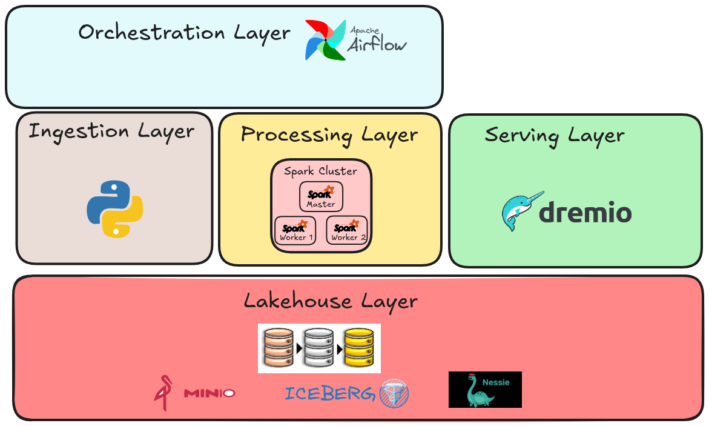

# AB Inbev Case

- **Autor**: Marco Aurelio Reis Lima Menezes
- **Objetivo**: Apresentação de solução para o case proposto pela AB Inbev
- **Motivo**: Processo seletivo para a vaga de Engenheiro de Dados Sênior

### Problema proposto

**Objetivo**: Consumir dados de uma API https://www.openbrewerydb.org e persistir esses dados em um data Lake. Usar a arquitetura medalhão com seus 3 layers (bronze, silver e gold);

#### Instruções

- Opções de orquestração em aberto, porém com demonstrar habilidades em como orquestrar um pipeline, tratamento de erros, monitoramento e logging;
- Linguagem em aberto. Python e Pyspark preferível mas não obrigatório;
- Uso de conteinerização. Docker ou Kubernetes por exemplo ganha pontos.

#### Especificações da arquitetura do data lake

- **Bronze**: Persistir os dados retornados pela API em sua forma bruta, sem tratementos e em formato nativo ou qualquer formato mais conveniente.
- **Silver**: 
    - Transformar o dado em um formato colunar, como parquet ou delta, e particionar por brewery location.
    - Fazer tratamentos no dado bruto` desde que justificando estes. Esses tratamento incluem como limpeza de dados, remoção de colunas redundantes, etc.
- **Gold**: Criar uma view agregada com a quantidade de breweries por tipo e localização.

#### Monitoring / Alerting

- Descrever como implementaria um processo de monitoramento e alerta para o pipeline;
- Considerar data quality issue, fahlas do pipeline e outros potenciais problemas na resposta

# Solução

#### Referências

A arquitetura de serviços reproduzida nesse trabalho é construída em docker e tendo como referência os seguintes repositórios:

- https://github.com/marcoaureliomenezes/ice-lakehouse
- https://github.com/marcoaureliomenezes/dd_chain_explorer

## 2. Introdução ao case criado

Dado o case proposto, esse repositório contempla uma solução que atende as especificações listadas acima. A solução foi construída em cima de uma arquitetura medalhão, com 3 camadas: bronze, silver e gold.

Algumas decisões de caracter técnico foram tomadas para a construção da solução. Abaixo serão enumeradas algumas dessas.

### 2.1. Cadência ou frequência do processo

Em um pipeline de dados, a natureza deste em relação ao tempo abrange diferentes características. Esses pipelines variam por um espectro com os seguintes extremos:
- **Ingestão batch** que vão de **frequências mensais, semanais, diárias, horárias**.
- **Micro-batch or near-real-time** com Spark streaming por exemplo e **processamento em tempo real** usando o Apache Flink.

Ao se projetar um pipelines, é importante entender a natureza do dado na origem e na ponta, para então decidir qual a melhor cadência de processamento. Alguns pontos a serem considerados são:
- A natureza do dado na origem, volumetria, velocidade e variabilidade;
- A natureza do dado na ponta e perguntas a serem respondidas, o que influencia diretamente máxima latência aceitável;
- Capacidade de processamento e armazenamento considerando parâmetros com throughput máximo, dis

#### 2.1.1. Natureza do dado na origem

1. O dado tem origem em a API https://www.openbrewerydb.org. 
2. Por inferência, esses dados estão provavelmente em um database, transacional NoSQL ou SQL, sendo consumidos pela API mencionada.
3. É possível supôr que esse dado, transacional, é alterado de forma assíncrona por uma 2ª API, que teria a finalidade de atualizar o cadastro das breweries.

Em casos produtivos semelhantes, geralmente inúmeras origens transacionais são ingestadas para um ambiente analítico, podendo tais origens sofrer operações de insert e update com frequências variadas.

Para esses casos opções interessantes são:

1. Usar um **Kafka Connect Source**, **Cluster de brokers Kafka** e **Kafka Connect Sink** ou arquitetura análoga usando serviços de cloud, e criar um fluxo de dados em tempo real baseado em CDC por exemplo para entregar o dado de origem transacional para o ambiente analítico. **Observação**: Nesse caso o dado é consumido diretamente do banco de dados de origem, sem passar pela API.

2. Usar **jobs em Python**, consumindo da API e produzindo mensagens em tópicos de um **Cluster de brokers Kafka**. E **job Spark Streaming** consumindo tópicos do Kafka e gravando o dado em uma tabela bronze, usando a estratégia de **ingestão em streaming multiplex**.

#### 2.1.2. A natureza do dado na ponta e perguntas a serem respondidas

Para esse case as perguntas a serem respondidas não foram explicitadas, mas inferidas a partir da descrição da View Gold.

Para entender como esse fator influencia na decisão de cadência do pipeline, digamos que as perguntas a serem respondidas na ponta são do tipo:
- "Quantas breweries foram adicionadas na última hora?" 
- "Quantas vezes e quando ocorreu o cadastro de uma brewery que foi alterado logo em seguida?" 

Para responder a essas perguntas a captura de dados em tempo real seria necessária.

#### 2.1.3. Escolha de frequência de processamento

- Posta a análise acima, após consultas na API e interpretação sobre o descritivo do case foi inferido que o dado não é atualizado tão frequentemente.
- Portanto, e uma ingestão batch de frequencia hora em hora é suficiente para atender a demanda. 

Porém dadas as características do dado, algumas técnicas foram implementadas para tratar o dado.

### 2.2. Arquitetura medalhão

A arquitetura medalhão tem por objetivo separar as camadas de ingestão, tratamento e consumo de dados. A arquitetura medalhão é composta por 3 camadas:

- **Bronze**: Camada de ingestão de dados, onde os dados são armazenados em sua forma bruta, sem tratamento.
- **Silver**: Camada de tratamento de dados, onde os dados são transformados e tratados para serem consumidos.
- **Gold**: Camada de consumo de dados, onde os dados são consumidos e transformados em informações úteis.

### 2.3. Bronze Layer

- A API retorna dados de breweries, que são entidades que podem ser alteradas ao longo do tempo.
- Um request é feito a API a cada hora para capturar os dados das breweries, retornando dados para breweries paginado por 50 registros.

- O formato escolhido para armazenar os dados brutos foi o JSON.
- Foi aplicada uma compressão GZIP nos arquivos JSON contendo os dados retornados pela API, de forma a reduzir o tamanho do arquivo.
- **Jobs de python são schedulados de hora em hora pelo Airflow** para escrever os dados como arquivos JSON compactados no MinIO.
- Os arquivos são escritos de forma particionada por data, no formato `year=YYYY/month=MM/day=DD`.
- A forma com que a API monta o nome do arquivo tem o template `000x-{hash[:16]}`, tendo o hash SHA-256 dos dados que compõem o arquivo como parte de seu nome.
- Essa estratégia torna possível que jobs de frequência em hora possam ser executados, mas não ingestem dados duplicados para aquele dia no lakehouse.

### 2.4. Silver Layer

Na camada silver, os dados brutos são transformados e tratados para serem consumidos. Para esse case, os seguintes tratamentos foram realizados:

- Foi analisado que os campos `adress_1` e `street` contêm a mesma informação e por isso foi decidido manter apenas o campo `adress_1`, renomeando-o para `address`.
- Foi visto também que os campos `state` e `state_province` contêm a mesma informação e por isso foi decidido manter apenas o campo `state`, dropando o campo `state_province`.

Também f

### Slowly Changing Dimensions (SCD)

- A API retorna dados de breweries, que são entidades que podem ser alteradas ao longo do tempo.

- Para tratar essas alterações, foi implementado um tratamento de Slowly Changing Dimensions (SCD) do tipo 2.

- O tratamento SCD tipo 2 é um dos mais comuns e é usado para manter o histórico de alterações de uma entidade ao longo do tempo. Portanto, quando ocorre uma alteração de um registro da brewery, uma nova linha é inserida na tabela, mantendo o histórico de alterações.

## 2. Arquitetura de Solução

No desenho abaixo estão sintetizadas as camadas de serviço que compõem a solução proposta.

**Layer de orquestração**: Serviços de orquestração de pipelines de dados. Responsável por schedular e executar os jobs de ingestão e transformação dos dados. O Apache Airflow é utilizado, bem como serviços auxiliares para o funcionamento dele. Os serviços auxiliares são o Postgres, que é o banco de dados do Airflow, Airflow Webserver, que é a interface web do Airflow, e o Airflow Scheduler, que é o serviço que executa os jobs agendados.

## 2. Arquitetura Técnica

Nessa sessão estão descritos os serviços que compõem a solução apresentada. Uma breve introdução sobre cada serviço, sua finalidade e como ele se encaixa na arquitetura proposta.

Para esse case foram usados serviços, aqui classificados como camadas.

### Camada Lakehouse

Na camada lakehouse estão os serviços que compõe o mesmo. Para essa arquitetura proposta a seguinte stack foi utilizada:

### 1. Serviço de armazenamento - MinIO 

- Minio é um serviço de armazenamento de objetos compatível com S3. 
- Devido a sua compatibilidade com o S3, ele é uma exelente escolha para ser usado como camada de armazenamento de dados em um lakehouse local para fins de desenvolvimento e testes.
- Surgindo a necessidade de escalar, o MinIO pode ser substituido por um serviço S3 da AWS, por exemplo.

### 2. Serviço de Catálogo e formato de tabelas

Na construção de um Lakehouse, um formato e catálogo de tabela são componentes fundamentais. Em conjunto esses componentes adicionam uma camada no topo de arquivos armazenados no data lake, possibilitando que usuários e aplicações possam ler dados de arquivos armazenados no data lake numa visão database-like.

O 1º serviço desse tipo foi o Apache Hive. criado pelo Facebook e depois tornado open source, veio para dar suporte a queries, no hive com a linguagem HQL, para consulta de dados armazenados em arquivos no HDFS. O Hive fornece ao mesmo tempo 2 capacidades que em arquitetura modernas foram segregadas, um `catálogo de tabelas` e um `formato de tabela`.

Nas arquiteturas de data lake modernas, o Hive ainda é o projeto open source mais usado para atender a finalidade de um catálogo de tabelas. Porém, as tabelas hive hoje são consideradas obsoletas, devido a falta de suporte a operações de escrita e atualização de dados e outros fatores limitantes. A única forma de fazer update em uma tabela hive é dando overwrite em toda tabela ou em uma partição, caso a tabela seja particionada.

A nova geração de tabelas conta com 2 componentes de peso, **tabelas delta** e **tabelas iceberg**. Ambas são tabelas que permitem operações de escrita e atualização de dados, além de outras funcionalidades avançadas como controle de versão de dados, controle de transações, operações de merge, entre outras.

- **O formato de tabela usado nesse case foi o Apache Iceberg**. O Motivo, implementar um formato diferente do usado no trabalho, as delta tables em conjunto com o Databricks. Não por querer ser contra a corrente, mas por compreender que se um formato ainda não matou o outro é porque hoje cada um tem seus pontos e contrapontos que os fazem coexistir. Compreender as semelhanças, diferenças e trade-offs entre esses formatos é um bom caminho para aprender o fundamento e não a ferramenta.

- **O catalogo de tabelas utilizado nesse case foi o nessie**. O motivo, o Nessie é um catalogo de tabelas open source que é compatível com tabelas iceberg. O Nessie é um projeto relativamente novo, mas que já conta com uma comunidade ativa e crescente. Adiciona uma camada de controle de versão sobre as tabelas iceberg, estilo Git, o que é muito interessante para explorar novas funcionalodades.

Ademais, a combinação Minio + Iceberg + Nessie é uma combinação que ainda não vi em nenhum projeto, e por isso, decidi implementar essa arquitetura

, afim de estudalo e compreende-lo melhor. 

Em data lakes implementados na cloud,como opções pode ser usado o Glue Catalog, em ambiente AWS, e o Unity Catalog em um lakehouse no databricks.
e hoje no mercado o Unity, da Databricks, é muito usado por grandes empresas, em conjunto com o Delta Lake como formato de armazenamento, ou o Glue Catalog, da AWS. No mundo open source, o catalogo Nessie é uma opção interessante, pois é compatível com tabelas Iceberg, um outro formato de tabela

- **Nessie**: Quando se fala em lakehouse, o catalogo de dados é um ponto chave. Existem os mais diversos serviços para essa finalidade.

