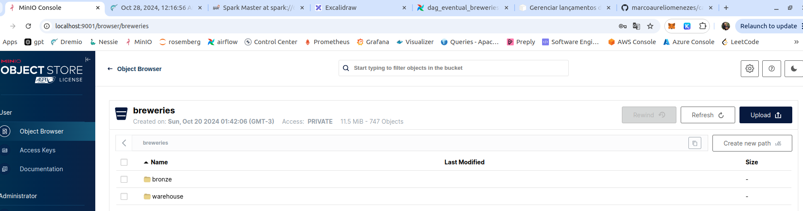

# AB Inbev Case

- **Autor**: Marco Aurelio Reis Lima Menezes
- **Objetivo**: Apresentação de solução para o case proposto pela AB Inbev
- **Motivo**: Processo seletivo para a vaga de Engenheiro de Dados Sênior

### Problema proposto

**Objetivo**: Consumir dados de uma API https://www.openbrewerydb.org e persistir esses dados em um data Lake. Usar a arquitetura medalhão com seus 3 layers (bronze, silver e gold);

#### Instruções

- Opções de orquestração em aberto, porém com demonstrar habilidades em como orquestrar um pipeline, tratamento de erros, monitoramento e logging;
- Linguagem em aberto. Python e Pyspark preferível mas não obrigatório;
- Uso de conteinerização. Docker ou Kubernetes por exemplo ganha pontos.

#### Especificações da arquitetura do data lake

- **Bronze**: Persistir os dados retornados pela API em sua forma bruta, sem tratementos e em formato nativo ou qualquer formato mais conveniente.
- **Silver**: 
    - Transformar o dado em um formato colunar, como parquet ou delta, e particionar por brewery location.
    - Fazer tratamentos no dado bruto` desde que justificando estes. Esses tratamento incluem como limpeza de dados, remoção de colunas redundantes, etc.
- **Gold**: Criar uma view agregada com a quantidade de breweries por tipo e localização.

#### Monitoring / Alerting

- Descrever como implementaria um processo de monitoramento e alerta para o pipeline;
- Considerar data quality issue, fahlas do pipeline e outros potenciais problemas na resposta

# Solução

#### Referências

## 2. Arquitetura técnica para o case criado

- De acordo com as especificações do case, são necessários serviços com diferentes funcionalidades.
- Foi escolhida a ferramenta **docker** para instanciar todos os serviços necessários localmente na forma de containers.
- Na pasta `services` estão definidos `arquivos yml` nos quais os serviços estão divididos por camadas.

A arquitetura de serviços reproduzida tem como referência projetos pessoais desenvolvidos nos seguintes repositórios:

- https://github.com/marcoaureliomenezes/ice-lakehouse
- https://github.com/marcoaureliomenezes/dd_chain_explorer

### 2.1. Camada Lakehouse

Na camada de serviços Lakehouse estão os serviços necessários para montar o Lake House. Esses serviços estão definidos no arquivo `/services/lakehouse.yml`. São eles:

#### 2.1.1. Storage - MinIO

- O MinIO é um serviço de armazenamento de objetos compatível com S3 é usado como storage para data Lakes.
- Como serviço análogo pode ser usado o S3 da AWS, o ADLS da Azure, ou um cluster Hadoop com seu HDFS, com a mesma finalidade.
- Após deploy de cluster uma UI do MinIO estará disponível em `http://localhost:9001`.

#### 2.1.2. Formato de tabela - Iceberg

- Formato de tabela que permite operações de escrita e atualização de dados, controle de versão, qualidade de dados, otimização de queries através de Z-Ordering e tecnicas de otimização de small files.
- Como formato análogo pode ser usado o Delta Lake, o formato open source debaixo do Databricks.

**Observação**: Iceberg é uma especificação de formato de tabela e portanto não um serviço em si. Para trabalhar com tabelas iceberg é necessário que os seviços de catálogo, armazenamento, processamento e query engine sejam compatíveis com tabelas iceberg, sendo necessário para alguns casos a instalação de uma biblioteca para suporte a iceberg.

#### 2.1.3. Catalogo de tabelas - Nessie

- Catalogo de tabelas open source que é compatível com tabelas iceberg e que adiciona uma camada de controle de versão sobre as tabelas iceberg, estilo Git.
- Como opção de catalogo de tabelas pode ser usado o Glue Catalog, em ambiente AWS, e o Unity Catalog em um lakehouse no databricks associado a delta tables.
- Para armazenar o estado do catalogo de tabelas, o Nessie usa um backend de banco de dados, nesse caso o Postgres também deployado como container.

#### 2.1.4. Query Engine - Dremio

Dremio é um serviço de query engine que permite a execução de queries SQL sobre dados armazenados em diferentes fontes de dados, como S3, HDFS, RDBMS, NoSQL, etc. Como serviço análogo pode ser usado o Trino, o Athena, entre outros.

Após deploy de cluster uma UI do Dremio estará disponível em `http://localhost:9047`.

### 2.2. Camada de Processamento

Na camada de processamento estão os serviços necessários para processar os dados. Foi utilizado o **Apache Spark**, ferramenta de processamento em memória distribuído e tolerante a falhas.

**Aplicações Spark são compostas por 1 driver e N executors**, sendo o driver é responsável por orquestrar a execução do job e os executors são responsáveis por executar as tarefas.

A forma de deploy da aplicação, em **cluster mode** ou **client mode**, determina se o driver executará a partir do client ou aplicação que submeteu o job. Ou se executará no cluster Spark em algum dos workers.

Existem diferentes formas de deploy de aplicações Spark, como **Kubernetes**, **YARN**, **Mesos** para gerenciar recursos e execução de jobs Spark dentro de um cluster.

Para um cluster Spark deployado de forma Standalone, a configuração de serviços **1 Spark Master** e **N Spark Worker** é o padrão. A quantidade "N" de workers pode ser ajustada conforme a necessidade de recursos computacionais.

Os serviços estão definidos no arquivo `/services/processing.yml`.

#### 2.2.1. Spark Master

- Serviço que gerencia a execução de jobs Spark no cluster.
- O Spark Master expõe uma interface web para monitoramento e gerenciamento do cluster chamado Spark UI, disponível em `http://localhost:18080`.

#### 2.2.2. Spark Workers

- Serviço que executa as tarefas dos jobs Spark.
- Nesse case fsão instanciados **2 workers com 1 core e 1GB de memória cada**.

#### 2.2.3. Notebook - Jupyterlab

- Aplicações Spark podem ser submetidas ao cluster, usando notebooks interativos como o Jupyterlab.
- O notebook age como driver, submetendo as tarefas ao cluster Spark.
- Esse notebook pode ser usado para explorar os dados, desenvolver e testar queries.
- O Jupyterlab estará disponível em `http://localhost:8888`.

### 2.3. Camada de Orquestração

- Na camada de orquestração estão os serviços de orquestração de pipelines de dados.
- **Foi utilizado o Apache Airflow** como ferramenta de orquestração.
- O Airflow pode ser deployado em um cluster Kubernetes, em um cluster de máquinas virtuais, em um cluster de containers, entre outros.
- A arquitetura de serviços necessários para o Airflow pode variar, de acordo com o tipo de executor e workloads a serem executados. 
- O airflow disponibiliza os **tipos de executores LocalExecutor, CeleryExecutor e KubernetesExecutor**, cada um com suas características e trade-offs.

Para esse case a configuração do airflow foi:
- **LocalExecutor**, para execução das tarefas em paralelo no mesmo host onde o Airflow está deployado.
- **Uso de DockerOperator**, para execução de tarefas em containers, desacoplando o ambiente de execução do ambiente de deploy.
- Os seguintes serviços foram deployados:
    - **Postgres**: como backend de metadados do Airflow. Armazena informações sobre DAG Runs, Tasks, Logs, etc.
    - **Airflow Webserver**: como interface web do Airflow, disponível em `http://localhost:8080`.
    - **Airflow Scheduler**: como serviço que executa as tarefas agendadas pelo Airflow.
    - **Airflow init**: como serviço que inicializa o Airflow, criando conexões, variáveis, pools, etc.

- Para esse case, o Apache Airflow foi deployado em um cluster de containers, com os serviços definidos no arquivo `/services/orchestration.yml`.

Nesse docmento
Dado o case proposto, esse repositório contempla uma solução que atende as especificações listadas acima. A solução foi construída em cima de uma arquitetura medalhão, com 3 camadas: bronze, silver e gold.

Algumas decisões de caracter técnico foram tomadas para a construção da solução. Abaixo serão enumeradas algumas dessas.

### 2.1. Cadência / frequência do processo

Em um pipeline de dados, a natureza deste em relação ao tempo abrange diferentes características. Esses pipelines variam por um espectro com os seguintes extremos:
- **Ingestão batch** que vão de **frequências mensais, semanais, diárias, horárias**.
- **Micro-batch or near-real-time** com Spark streaming por exemplo e **processamento em tempo real** usando o Apache Flink.

Ao se projetar um pipelines, é importante entender a natureza do dado na origem e na ponta, para então decidir qual a melhor cadência de processamento. Alguns pontos a serem considerados são:
- A natureza do dado na origem, volumetria, velocidade e variabilidade;
- A natureza do dado na ponta e perguntas a serem respondidas, o que influencia diretamente máxima latência aceitável;
- Capacidade de processamento e armazenamento considerando parâmetros com throughput máximo, limites operacionais e custos.

#### 2.1.1. Natureza do dado na origem

1. O dado tem origem em a API https://www.openbrewerydb.org. 
2. Por inferência, esses dados estão provavelmente em um database, transacional NoSQL ou SQL, sendo consumidos pela API mencionada.
3. É possível supôr que esse dado, transacional, é alterado de forma assíncrona por uma 2ª API, que teria a finalidade de atualizar o cadastro das breweries.

Em casos produtivos semelhantes, geralmente inúmeras origens transacionais são ingestadas para um ambiente analítico, podendo tais origens sofrer operações de insert e update com frequências variadas.

Para esses casos opções interessantes são:

1. Usar um **Kafka Connect Source**, **Cluster de brokers Kafka** e **Kafka Connect Sink** ou arquitetura análoga usando serviços de cloud, e criar um fluxo de dados em tempo real baseado em CDC por exemplo para entregar o dado de origem transacional para o ambiente analítico. **Observação**: Nesse caso o dado é consumido diretamente do banco de dados de origem, sem passar pela API.

2. Usar **jobs em Python**, consumindo da API e produzindo mensagens em tópicos de um **Cluster de brokers Kafka**. E **job Spark Streaming** consumindo tópicos do Kafka e gravando o dado em uma tabela bronze, usando a estratégia de **ingestão em streaming multiplex**.

#### 2.1.2. A natureza do dado na ponta e perguntas a serem respondidas

Para esse case as perguntas a serem respondidas não foram explicitadas, mas inferidas a partir da descrição da View Gold.

Para entender como esse fator influencia na decisão de cadência do pipeline, digamos que as perguntas a serem respondidas na ponta são do tipo:
- "Quantas breweries foram adicionadas na última hora?" 
- "Quantas vezes e quando ocorreu o cadastro de uma brewery que foi alterado logo em seguida?" 

Para responder a essas perguntas a captura de dados em tempo real seria necessária.

### 2.2. Escolha de cadência / frequência de processamento para o case

Consideradas as digressões sobre o tema acima, foi feitas consultas a API, para compreender melhor as características do dado. Inferindo-o com um dado cadastral, pode se dizer que deva ser um dado atualizado com pouca frequência.

Dessa forma, foi definido um **pipeline batch de frequência hora em hora** como suficiente para atender os requisitos. 

Porém dadas as características do dado, algumas técnicas foram implementadas para tratar o dado.

## 3. Arquitetura medalhão

A arquitetura medalhão tem por objetivo separar as camadas de ingestão, tratamento e consumo de dados. A arquitetura medalhão é composta por 3 camadas:

- **Bronze**: Camada de ingestão de dados, onde os dados são armazenados em sua forma bruta, sem tratamento.
- **Silver**: Camada de tratamento de dados, onde os dados são transformados e tratados para serem consumidos.
- **Gold**: Camada de consumo de dados, onde os dados são consumidos e transformados em informações úteis.

### 3.1. Job de captura e ingestão em camada Bronze

A seguir são apresentados os detalhes da implementação de captura e ingestão do dado.

- Foram usados aplicações feitas em python para consumir a API e escrever os dados no data lake camada bronze.
- A implementação desse Job está na pasta `/docker/app_layer/python_jobs/`.
- Conforme mencionado, o job foi agendado para rodar de hora em hora.

#### 3.1.1. Características de captura do dado:

- A API retorna dados de breweries, entidades que podem ser alteradas ao longo do tempo.
- Cada request GET para a rota `/breweries` da API retorna uma lista de breweries paginada.
- Foi optado por realizar**requests com 200 registros por página** até que a API retorne uma lista vazia, indicando que todos os registros foram capturados.

#### 3.1.2. Características do processo de ingestão da camada bronze

- **Para a camada bronze foi escolhido o formato JSON**, preservando a estrutura original dos dados.
- Cada arquivo JSON representa uma página de dados retornada pela API.
- Foi aplicado o **algoritmo de compressão GZIP nos arquivos JSON**, de forma a reduzir o tamanho do arquivo e consequentemente o custo de armazenamento.
- **Jobs de python são schedulados de hora em hora pelo Airflow** para escrever os dados como arquivos JSON compactados no MinIO.
- Os arquivos são escritos de forma particionada por data, no formato `year=YYYY/month=MM/day=DD`.

### 3.1.3. Estratégia de deduplicação na camada bronze

- Os jobs de captura e ingestão executarão de hora em hora.
- Porém, o dado é escrito na camada bronze de forma particionada por data a nível de dia.
- Essa divergência é proposital e tem o objetivo de evitar a ingestão de dados duplicados para um mesmo dia.

Para que isso ocorra, a forma com que o nome do arquivo é montado tem um papel fundamental. A estratégia adotada foi a seguinte:

- A cada hora o job faz requestes para API e escreve os dados em "pastas" de particionamento diário.
- Exemplo `/breweries/bronze/year=2022/month=02/day=01/`.
- Os arquivos JSON compactados usando compressão GZIP são nomeados da seguinte forma:
    - **Pagina number**: Número da página retornada pela API que originou o arquivo, com zero-padding para 4 dígitos.
    - **Numero de registros**: Número de registros na página.
    - **Hash SHA-256**: Hash SHA-256 dos dados que compõem o arquivo, truncado para 16 caracteres.
- Portanto o nome do arquivo segue o padrão `/breweries/bronze/year=2022/month=02/day=01/{page}-{page_size}-{hash[:16]}.json.gz`.

A forma com que o nome do arquivo é montado é uma estratégia para garantir que o dado não seja duplicado. Se o dado não altera para uma mesma página retornada pela API, o hash SHA-256 será o mesmo com um simples check de existência do arquivo é possível evitar a ingestão de dados duplicados.

**Observação 1**: A granularidade de particionamento diário escolha no projeto, evita duplicação de dados pelos jobs de ingestão que rodam de hora em hora. A depender da frequência de atualização é possível alterar a granularidade para mensal, semanal ou semanal por exemplo. Porém, no case, a redução de horas para dias foi suficiente, podendo reduzir custos de armazenamento em até 24 vezes.

**Obsevação 2**: A lógica implementada para evitar a ingestão de dados duplicados é uma estratégia simples e eficaz. Porém, vale ressaltar que a técnica aplicada pode ser sensível a alterações na paginação por exemplo. Logo, para casos produtivos uma análise mais aprofundada se faz necessária.

### 2.4. Camada Silver

Na camada silver, os dados brutos são transformados e tratados para serem consumidos. Para esse case, a **tabela silver breweries** tem as seguintes características:

- Tabela no formato Iceberg, com dados armazenados em formato colunar Parquet e particionados por `country`.
- O formato Iceberg, assim como o delta, possibilita operações de escrita e atualização de dados, bem como operações de merge, controle de versão.
- Nesse trabalho a operação de MERGE desempenha um papel importante, ao aplicar **Slowly Changing Dimensions (SCD) do tipo 2** sobre os dados da camada bronze.
- Outras funcionalidades como o controle de versão de dados e otimização de small files ou aplição de Z-Ordering são possíveis com o Iceberg, otimizando a performance de queries.

#### 2.4.1. Tratamentos realizados sobre dado bruto

- Foi analisado que os campos `adress_1` e `street` contêm informações redundantes. Logo, somente o campo `adress_1` foi mantido, sendo renomeado para `adress`.
- Foi analisado que os campos `state` e `state_province` contêm a mesma informação e por isso foi decidido manter apenas o campo `state`.
- Os campos `latitude` e `longitude` convertidos do tipo string para double.

Foram tratados camp

### 2.4.2. Slowly Changing Dimensions (SCD)

- A API retorna dados de breweries, que são entidades que podem ser alteradas ao longo do tempo.
- Para tratar essas alterações, foi implementado um tratamento de Slowly Changing Dimensions (SCD) do tipo 2.

- O tratamento SCD tipo 2 é um dos mais comuns e é usado para manter o histórico de alterações de uma entidade ao longo do tempo. Portanto, quando ocorre uma alteração de um registro da brewery, uma nova linha é inserida na tabela, mantendo o histórico de alterações.

## 2. Arquitetura de Solução

No desenho abaixo estão sintetizadas as camadas de serviço que compõem a solução proposta.

